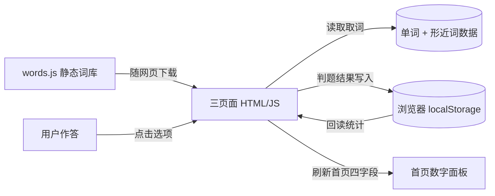

# TECH_DESIGN.md ——「四级备考助手」技术设计文档（Day 5）

> 本文档按 PRD.md 已定方向（纯前端 + localStorage、无后端）展开。
> 编写方式：按 Day 5 板块顺序逐步补充。本文件已含全部小节（一～十）：前后端分工、技术路线、项目结构、数据对象及字段、读写清单、数据流图、错误处理、环境变量、部署迁移、待定项。
> 配套文档：PRD.md（需求）、research.md（调研）、AGENTS.md（协作规矩）。

---

## 一、前后端与数据库分工（第①步）

### 1.1 三个角色在本项目怎么落

| 角色 | 传统含义 | 本项目对应 | 落在哪 |
|---|---|---|---|
| 前端 | 用户看得到、点得动的界面与交互 | 三个页面 + 前端 JS 逻辑 + CSS | 浏览器里运行的 HTML / JS / CSS 文件 |
| 后端 | 服务器上的程序，负责存数据、算逻辑 | **本项目没有** | 无 |
| 数据库 | 集中存数据的服务器 | **用浏览器 localStorage 顶替** | 用户设备本地（不在任何服务器） |

### 1.2 为什么这么分（对照 PRD）

PRD 第一节写明：纯前端网页、词库静态本地加载、学习数据存 localStorage、无后端、无需联网拉词。

- **取词不依赖服务器**：`words.js` 是随网页一起下载的静态文件，浏览器直接读，不用向后台发请求。
- **判题、统计、错题管理全在浏览器 JS 里算**，不调用任何后端接口。
- **"数据库"由 localStorage 扮演**：它存「今日新学数量 / 待复习错题数量 / 累计学习单词 / 答题正确率 / 错题本」这五类数据。

### 1.3 这种分工的代价（提前说清）

- 数据存在用户自己设备本地，换浏览器 / 清缓存 / 用别人电脑，进度就没了；作者（你）也看不到、改不了别人设备上的数据。
- 因此 PRD 把「用户登录 / 云同步」列到后续功能——那就是补这个短板的方案（方案 B）。

### 1.4 本步尚未决定

- 是否在本版就预留"以后接后端云同步"的接口结构？目前按"纯本地"设计、不预留；若你后面想加，再开方案 B 补一节。

---

## 二、技术路线（方案比较 + 推荐）（第②步）

### 2.1 两套候选方案

| 维度 | 方案 A：纯前端 + localStorage（PRD 已定） | 方案 B：前端页面 + 后端云同步（Supabase / CloudBase 等） |
|---|---|---|
| 架构 | 三页面 + words.js 静态词库 + 浏览器 localStorage | 同上前端 + 云数据库（存用户进度）+ 账号登录鉴权 |
| 零基础学习成本 | 低：只学 HTML / JS / CSS 和 localStorage 读写 | 高：额外学后端、数据库、登录、接口调用 |
| 线上持久化 | 弱：数据只在本机浏览器，换设备 / 清缓存会丢 | 强：数据在云端，换设备登录仍在 |
| 费用 | 0：静态托管（GitHub Pages / WorkBuddy host）多免费 | 有：云数据库 / 函数按量计费，免费额度有限 |
| 排错难度 | 低：问题都在浏览器，F12 看控制台即可 | 高：前端 + 网络 + 后端 + 数据库多环节，报错难定位 |

### 2.2 默认路线：方案 A

推荐走方案 A，理由：

1. **贴合 PRD**：PRD 已明确"无后端、纯前端、localStorage"，方案 A 完全照此，不推翻既有决定。
2. **学习负担最小**：零基础、28 天窗口、一人做。方案 A 只要求学会 HTML / JS / CSS + 一个 localStorage 读写，先把"学 + 测 + 复习"闭环跑通最要紧。
3. **零费用、零运维**：部署用免费静态托管即可，不被账号 / 付费卡住（你也说过 GitHub 访问都费劲，再叠一家云服务商只会更难）。
4. **排错友好**：问题都局限在浏览器内，适合自学没人随时答疑。

### 2.3 为什么"暂时"选 A（方案 B 何时再考虑）

方案 A 唯一短板是数据不跨设备。当下面任一条成立，再升级到方案 B：

- 你想在手机和电脑之间同步进度；
- 想做"打卡排行榜"等需要集中存数据的后续功能；
- 用户量起来、需要后台看数据。

届时升级，前端页面代码基本不动，只是把 localStorage 读写换成"调后端接口"。所以**现在不预留后端接口也不影响以后升级**——这也回答了第①步的待定点。

### 2.4 本步尚未决定

- 方案 B 具体用哪家云（Supabase 还是 CloudBase）、是否要登录——等真要做云同步时再定，本版不写。

---

## 三、项目结构

```
vibe-coding/
├── index.html        # 首页：汇总四个数字字段 + 两个入口
├── study.html        # 新词学习页：选择题背词
├── review.html       # 错题复习页：错题重做
├── words.js          # 静态词库（四级核心高频词，含形近词绑定），全局变量 WORDS
├── app.js            # 前端逻辑：出题 / 判题 / 统计 / localStorage 读写（三页面共享）
├── style.css         # 页面样式
├── TECH_DESIGN.md    # 本技术设计文档
├── PRD.md            # 产品需求文档
└── research.md       # 调研文档
```

- 三个 `.html` 对应 PRD 的三个页面；`app.js` 被三页共享，避免重复逻辑。
- `words.js` 用 `<script src="words.js"></script>` 引入，页面脚本读全局 `WORDS` 取词。
- 说明：页面组织默认"三个独立 html 文件"，零基础最直观；也可用单页多视图，属待定（见第十节）。

---

## 四、数据对象及字段（localStorage 存储结构）

本项目无后端、无服务器数据库，全部学习数据存浏览器 localStorage，按以下键组织：

### 键 `cet4_stats`（对象：汇总统计）

| 字段 | 类型 | 含义 | 何时读写 |
|---|---|---|---|
| `todayDate` | 字符串 "YYYY-MM-DD" | 记录"今日新学"对应的日期，用于跨天清零判断 | 启动 / 跨天时写 |
| `todayNew` | 数字 | 今日新学数量（自然日，每日 0 点归零） | 新词作答后 +1；跨天归零 |
| `totalLearned` | 数字 | 累计学习单词（去重新词总数，永久不清零） | 新词首次学完去重 +1 |
| `correct` | 数字 | 累计答对题数 | 每次作答对 +1 |
| `totalAnswered` | 数字 | 累计总答题数 | 每次作答 +1 |

> 首页四字段对应：今日新学数量=`todayNew`；待复习错题数量=`cet4_wrong` 中 status=pending 的条数（不单独存）；累计学习单词=`totalLearned`；答题正确率=`correct/totalAnswered`。

### 键 `cet4_wrong`（数组：错题本）

每条：`{ word: "develop", addedAt: 时间戳, status: "pending" | "mastered" }`
- `status=pending`：待复习；`status=mastered`：已掌握（错题复习答对后改）。
- 写入：新词答错时 push；读取：错题复习页取 pending 项；更新：答对改 mastered。

### 键 `cet4_learned`（数组：已学过去重新词英文）

- 用途：新词学习页去重"今日新词"、累计学习单词去重。
- 写入：每次新词学完 push（已存在则跳过）。

---

## 五、读写清单（替代"API 列表"）

本项目无后端、无 HTTP 接口，所有"接口"都是前端对 localStorage 的读写函数。每个 MVP 动作都有本地替代方案：

| MVP 动作 | 读取 | 写入 |
|---|---|---|
| 取今日新词 | 读 `words.js`（静态）+ `cet4_learned`（去重） | — |
| 记录一次新词作答 | — | 写 `cet4_stats`（todayNew+1、totalLearned 去重+1、correct/totalAnswered+1）；答错写 `cet4_wrong` + `cet4_learned` |
| 取待复习错题 | 读 `cet4_wrong`（status=pending） | — |
| 记录一次错题作答 | — | 写 `cet4_stats`（correct/totalAnswered+1）；答对改 `cet4_wrong[i].status=mastered` |
| 读首页汇总 | 读 `cet4_stats` + `cet4_wrong` 长度 | — |
| 自然日清零 | 启动比对 `cet4_stats.todayDate` 与今天 | 不同则 `todayNew=0` 且 `todayDate=今天` |

> 对应 PRD 验收标准：每个 MVP 写入 / 读取动作都有上方本地方案，无需任何网络请求。

---

## 六、数据流 / 数据从哪来、到哪去



**数据从哪来**：单词来自项目里的静态词库 `words.js`（随网页一起下载到浏览器，**不联网**）；用户每次点击选项是进度的"输入源"。

**数据到哪去**：作答结果全部写进浏览器 `localStorage`（`cet4_stats` / `cet4_wrong` / `cet4_learned`），再由页面读出来刷新首页四个数字。

**一句话**：词从 `words.js` 文件来，进度进 localStorage 本地仓库，页面从 localStorage 读出来给你看。

---

## 七、错误处理

- **localStorage 不可用**（隐私模式 / 浏览器禁用存储）：启动时 `typeof Storage` 检测；不可用则提示"进度无法保存，请换普通浏览器"，功能降级为当次会话有效、关掉即丢。
- **写入容量满**（配额约 5MB，本项目数据极小，基本碰不到）：所有写入 `try/catch`，失败提示"本地存储已满，请清理浏览器数据"。
- **words.js 加载失败**（文件缺失 / 路径写错）：页面检测全局 `WORDS` 未定义则提示"词库未加载"，阻止出题。
- **跨天清零边界**：以浏览器本地时间判断自然日；用户手动改系统时间可能导致清零异常——已知限制，标注在此。

---

## 八、环境变量

- 本项目纯静态、无后端、无密钥，**不需要任何环境变量**。
- 若以后接方案 B 云同步：届时才有 API 地址 / 密钥类变量，单独记一节、不放进前端代码明文。

---

## 九、部署和迁移注意事项

- **部署**：纯静态，托管到 GitHub Pages 或 WorkBuddy host 即可（上传 html / js / css / words.js）。无需服务器、无需数据库迁移。
- **迁移 / 备份铁律**：localStorage 数据**不随代码走**——换设备、清缓存、用别人电脑，进度会丢；作者也收不到。
  - 避免数据丢失的约束：本版靠用户自己不清理浏览器数据；要备份 / 跨设备，必须等方案 B 云同步（数据进云端、随账号走）。
  - **不要误以为"迁移网站代码"会把用户进度也带过去**——代码在仓库，数据在各人浏览器，是两套东西。

---

## 十、尚未决定的地方

- 三页面用"三个独立 html"还是"单页多视图"？（默认三 html，最简单）
- 方案 B 云同步具体选型（Supabase / CloudBase）、是否要登录——等需要做时再定
- 累计学习单词的去重粒度（按单词去重）

---

## 每日一问（一句话总结数据流向）

**单词来自项目里的静态词库 `words.js`（随网页下载、不联网）；用户作答产生的学习进度全部写进浏览器 localStorage；页面再从 localStorage 读出来刷新首页——词从文件来，进度进本地，页面从本地读。**
